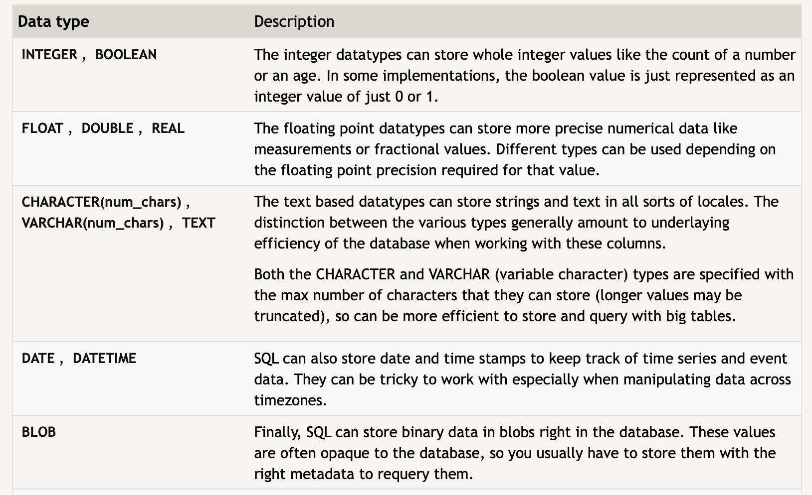

# GIT

```c
mygit branch something1
// (Create a new branch)

git checkout something1
// (Switch to the “something1” branch)

// (If you did something in the branch where you checkouted)
git add .
git commit -m"Penisz"
git push origin something1
// (Upload branch to GITHUB)

git checkout master
// (Switch back to master branch)

git merge something1
// (Merge master branch with something1 branch)
// (Important to be in master branch when you are doing this)

git branch -d something1
// (If something1 branch no longer need, delete it from computer)

git push origin master
// (Push previously merged things)

git push origin —delete something1
// (Delete something1 branch from GITHUB)
// (We just deleted it from your computer before, so its important)
```


# SQL

### INSTALL: 
- (Must have) [MySQL Community Server](https://dev.mysql.com/downloads/mysql/)
- (Optional but worth it) [MySQL Workbench](https://dev.mysql.com/downloads/workbench/)

> Don't forget your SQL password. Here is mine: "shark121"

> After installation open your terminal and try to execute mysql if the command was not found add the binaries to your PATH.  If you can't do it: [CLICK](http://lmgtfy.com/?q=k%C3%B6rnyezeti+v%C3%A1ltoz%C3%B3+hozz%C3%A1ad%C3%A1sa)   


### MUST HAVE
| Material                                                                                       |     Time |
|:-----------------------------------------------------------------------------------------------|---------:|
| [What is Database & SQL?](https://www.youtube.com/watch?v=FR4QIeZaPeM)                         |     6:19 |
| [Understanding database concepts and terminology](https://www.youtube.com/watch?v=CdmK125jI8s) |     7:26 |
| [Relational Database Concepts](https://www.youtube.com/watch?v=NvrpuBAMddw)                    |     5:24 |
| [MySQL Tutorial - (Do it for yourself too while watching)](https://www.youtube.com/watch?v=yPu6qV5byu4)       |    41:09 |

#### Optional
| Material                                                                                                                                           |    Time |
|:---------------------------------------------------------------------------------------------------------------------------------------------------|--------:|
| [Data modelling - an introduction](https://www.youtube.com/watch?v=tR_rOJPiEXc)                                                                    |   55:21 |
| [How Data is Organized and Normalization](https://www.essentialsql.com/get-ready-to-learn-sql-database-normalization-explained-in-simple-english/) | reading |

- [SQLBolt - Introduction to SQL](https://sqlbolt.com/lesson/introduction)
- [SQLBolt - SQL Lesson 1: SELECT queries 101](https://sqlbolt.com/lesson/select_queries_introduction)
- [SQLBolt - SQL Lesson 2: Queries with constraints (Pt. 1)](https://sqlbolt.com/lesson/select_queries_with_constraints)
- [SQLBolt - SQL Lesson 3: Queries with constraints (Pt. 2)](https://sqlbolt.com/lesson/select_queries_with_constraints_pt_2)
- [SQLBolt - SQL Lesson 4: Filtering and sorting Query results](https://sqlbolt.com/lesson/filtering_sorting_query_results)
- [SQLBolt - SQL Lesson 13: Inserting rows](https://sqlbolt.com/lesson/inserting_rows)
- [SQLBolt - SQL Lesson 14: Updating rows](https://sqlbolt.com/lesson/updating_rows)
- [SQLBolt - SQL Lesson 15: Deleting rows](https://sqlbolt.com/lesson/deleting_rows)

```c
mysql -u username -p
// (This is how to login to your SQL. After you pressed ENTER, type your password.)

quit
show databases;
CREATE DATABASE name;
USE name;
// (You will never figure out what does these command do!)

SELECT DATABASE ();
// (Show the current database)

DROP DATABASE IF EXISTS name;
// (Delete the "name" database)

CREATE TABLE name(
    name VARCHAR(30) NOT NULL,
    email VARCHAR(60) NULL,
    zip INT UNSIGNED NOT NULL,
    state VARCHAR(2) NOT NULL DEFAULT “PA”,
    sex ENUM(“MALE”, “FEMALE”) NOT NULL,
    date_of_enter TIMESTAMP,
    student_id INT UNSIGNED NOT NULL  AUTO_INCREMENT PRIMARY KEY);
// (Here you can see how to create a table with different varriables, commands etc.)
```




#### You should meet with these commands bellow at SQL LESSONS

```c
SELECT Title, Year FROM Movies WHERE ID < 6 AND Year NOT BETWEEN 1996 AND 2001;
// (This is how you search. I tryed to use different operators and commands to understand how it works)
```


```c
SELECT DISTINCT director FROM movies ORDER BY director ASC LIMIT 3 OFFSET 5;
// (This is how you search without duplicates (DISTINCT) and how to order by and with limit)
// (If u want to reverse your order by, use DESC)

INSERT INTO Movies VALUES (4, Toy Story 4, Toth Mark, 2018, 100);
// (This is how you add a new data)

UPDATE Movies SET Title = "Toy Story 3", Director = "Lee Unkrich" WHERE Id = 11;
// (This is how you update multiplate informations at a specified place. Like where ID is 11)

DELETE FROM Movies WHERE Year < 2005;
// (This is how you delete from your database)
```
